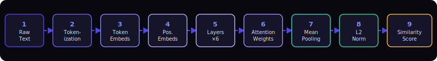
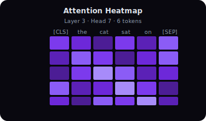
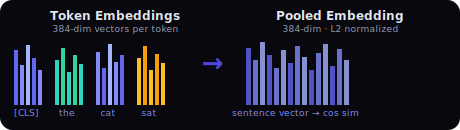

<div align="center">

# AttentionSeeker
### *It's not you, it's your embeddings.*

> An interactive, step-by-step visualizer for how `all-MiniLM-L6-v2` encodes text into dense vector embeddings — one layer at a time.



[](https://python.org)
[](https://fastapi.tiangolo.com)
[](https://react.dev)
[](https://pytorch.org)
[](LICENSE)

</div>

---

## Table of Contents

1. [What It Does](#what-it-does)
2. [Live Visualizations](#live-visualizations)
3. [Architecture](#architecture)
4. [Key Concepts Defined](#key-concepts-defined)
5. [Iteration History](#iteration-history-7-phases)
6. [Bugs Solved](#bugs-solved)
7. [Running Locally](#running-locally)
8. [API Reference](#api-reference)
9. [Tests](#tests)
10. [Deployment](#deployment)

---

## What It Does

AttentionSeeker walks you through **9 internal stages** of a sentence transformer — exposing every intermediate tensor, from raw WordPiece tokens all the way to a normalized 384-dimensional embedding ready for cosine similarity.

| Step | Name | What you interact with |
|------|------|------------------------|
| 1 | **Raw Text Input** | Live token-count estimate updates as you type |
| 2 | **Tokenization** | Color-coded WordPiece pills — click any to inspect its 384-dim histogram |
| 3 | **Token Embeddings** | Per-token lookup vectors rendered as D3 bar charts |
| 4 | **Positional Embeddings** | Position-dependent offset vectors (same shape, different values) |
| 5 | **Transformer Layers ×6** | Hidden states after each of the 6 BertLayer passes |
| 6 | **Attention Weights** | Full N×N heatmap — pick any of 6 layers × 12 heads |
| 7 | **Mean Pooling** | Animated collapse: all token vectors → one sentence vector |
| 8 | **L2 Normalization** | Scaled to unit length for numerically stable cosine similarity |
| 9 | **Similarity Comparison** | Cosine dial + UMAP/PCA scatter vs 8 reference sentences |

---

## Live Visualizations

<div align="center">

&nbsp;&nbsp;&nbsp;

</div>

*Left: attention weights pulsing across 6 tokens × 6 tokens. Right: per-token embeddings being mean-pooled into a single sentence vector.*

---

## Architecture

```
Browser (React 18 + Vite)
  |
  |  POST /encode  { sentence, layer? }
  |  POST /similarity  { sentence_a, sentence_b }
  v
FastAPI  (Python 3.12)
  |-- Lifespan model loader (singleton SentenceTransformer)
  |-- PyTorch forward hooks on each BertLayer -> hidden states
  |-- output_attentions=True (eager mode) -> attention weights
  |-- Mean pooling + L2 norm -> pooled_embed
  `-- UMAP / PCA -> 2D projection for scatter plot
```

```
frontend/src/
|-- App.jsx                  # Step router + encode bar + live token count
|-- store/useVizStore.js     # Zustand global state (data, step, error)
|-- api/client.js            # Axios + VITE_API_BASE_URL env support
`-- components/
    |-- StepStepper.jsx      # 9-pill navigator + keyboard (<- ->) + progress bar
    |-- TokenView.jsx        # Pills + D3 histogram on click
    |-- AttentionHeatmap.jsx # D3 heatmap + layer/head selectors (role=tablist)
    |-- EmbeddingBar.jsx     # 384-dim bar charts
    |-- PoolingAnim.jsx      # Framer-motion collapse animation
    |-- SimilarityView.jsx   # D3 cosine dial + UMAP scatter
    |-- InfoCard.jsx         # Expandable plain-language explanations
    `-- Skeleton.jsx         # Shimmer placeholders during API loading
```

---

## Key Concepts Defined

<details>
<summary><strong>WordPiece Tokenization</strong></summary>

WordPiece splits rare words into known sub-words. `"embeddings"` → `["embed", "##dings"]`. Prefix `##` marks continuation. Two special tokens are always added: `[CLS]` (position 0, used for classification) and `[SEP]` (end of sequence). The model sees token IDs, not raw text.

</details>

<details>
<summary><strong>Token & Positional Embeddings</strong></summary>

Each token ID maps to a learned 384-dimensional vector via a lookup table (token embeddings). Transformers process all tokens in parallel, so word order information must be injected separately: a second lookup table maps each position index (0, 1, 2 …) to a 384-dim positional vector. Both are summed before entering the transformer stack.

</details>

<details>
<summary><strong>Multi-Head Self-Attention</strong></summary>

Each of the 6 transformer layers contains 12 independent attention heads. Every head computes Q·Kᵀ / √d scores (how much each token should attend to every other), applies softmax (so each row sums to 1.0), and uses the result to weight-sum the value vectors. Different heads learn qualitatively different patterns — e.g. one head may link pronouns to antecedents, another may connect verbs to subjects.

</details>

<details>
<summary><strong>Mean Pooling</strong></summary>

After 6 transformer layers, each token has a rich context-aware 384-dim representation. To produce a single fixed-size sentence vector, we average all token representations dimension-by-dimension. This is called mean pooling and is the strategy used by `all-MiniLM-L6-v2`.

</details>

<details>
<summary><strong>L2 Normalization</strong></summary>

The pooled vector is divided by its Euclidean length, projecting it onto the unit hypersphere. This means cosine similarity between two sentence vectors reduces to their dot product — fast and numerically stable. Two semantically identical sentences will have cosine ≈ 1.0; unrelated sentences ≈ 0; antonyms ≈ −1.

</details>

<details>
<summary><strong>UMAP / PCA Projection</strong></summary>

The similarity view projects 10 sentence embeddings (your 2 + 8 reference sentences) from 384 dimensions into 2D for visualization. UMAP is used when available (preserves cluster structure); PCA is the fallback (preserves variance).

</details>

---

## Iteration History (7 Phases)

Each phase is an independent, git-committed increment — the project was designed for an iterative build log.

### Phase 1 — Scaffold `feat(phase1)`
- Initialized monorepo: `backend/` (Python) + `frontend/` (Vite React)
- `.gitignore`, `README` stub, `backend/.env`, `requirements.txt`
- Vite scaffold with `npm create vite@latest`

### Phase 2 — Backend `feat(phase2)`
- **Singleton model loading** with `lifespan` context in FastAPI
- **PyTorch forward hooks** (`register_forward_hook`) on each of 6 `BertLayer` instances to capture hidden states
- `output_attentions=True` for attention weight extraction at inference time
- `float16` quantization of hidden states to halve payload (~700KB → ~350KB)
- **GZip middleware** on FastAPI for further compression
- Endpoints: `GET /health`, `POST /encode` (optional `?layer=N`), `POST /similarity`

### Phase 3 — Frontend `feat(phase3)`
- **Zustand** global store: `data`, `currentStep`, `loading`, `error`, `selectedLayer`, `selectedHead`
- **Axios** client with `VITE_API_BASE_URL` env support and typed error handling (422, offline, 5xx)
- `StepStepper` — 9 pills, progress bar, keyboard (← →) navigation, `aria-label` on each pill
- `TokenView` — color-coded pill types (`[CLS]`=amber, `##subword`=teal, regular=slate), D3 mini histogram on click
- `AttentionHeatmap` — D3 N×N heatmap with purple sequential scale (color-blind safe), layer/head `role="tablist"` selectors, tooltip on hover
- `EmbeddingBar` — 384-dim bar charts for token, positional, and final hidden states using D3
- `PoolingAnim` — framer-motion staggered collapse animation showing tokens → pooled vector
- `SimilarityView` — D3 cosine arc dial + UMAP scatter plot with focal vs reference distinction

### Phase 4 — API Wiring `feat(phase4)`
- **Loading skeletons** (`Skeleton.jsx`) — shape-matched shimmer placeholders per step while API call is in-flight
- **Live approximate token count** badge (1.3 × word count + 2) while typing
- **Long-input warning** banner for inputs estimated >100 tokens (model truncates at 128)
- Error returns user to step 0 instead of leaving stale data visible
- Empty-input button disabled with tooltip; `warn-border` CSS on input field

### Phase 5 — Tests `test(phase5)`
- **Backend pytest** (`test_encoder.py`): tokenization, CLS/SEP bookends, embedding shapes (seq×384), 6-layer coverage, 12-head coverage, attention row sum = 1.0, L2 norm ≈ 1.0, lazy layer loading, single-word edge case
- **Backend pytest** (`test_routes.py`): `/health`, `/encode` (valid, 422 on empty/whitespace, `?layer=` param, token_count match), `/similarity` (score range, 10 UMAP points, 422 on empty)
- `conftest.py` — stubs `torch`, `sentence_transformers`, `umap` at collection time; auto-skips encoder tests when torch absent
- **Frontend Vitest** (`TokenView`, `AttentionHeatmap`, `StepStepper`): 10 assertions total, all pass

### Phase 6 — Polish & Accessibility `feat(phase6)`
- `InfoCard.jsx` — expandable ⓘ chip with framer-motion height animation, `aria-expanded`, plain-language copy explaining each step for non-ML readers
- `:focus-visible` global ring for keyboard-only navigation
- `@media (max-width: 600px)` responsive breakpoints — stacked encode bar, minimal stepper labels, horizontal-scroll selector rows
- Cleared Vite boilerplate from `App.css`

### Phase 7 — Deployment `feat(phase7)`
- `backend/Dockerfile` — Python 3.12-slim multi-stage, model pre-baked into image layer
- `frontend/Dockerfile` — Node 20 Vite build → nginx:alpine, `/api/` proxy to backend
- `docker-compose.yml` — health-check dependency, ports 8000 / 3000
- **Root `Dockerfile`** for Hugging Face Spaces (Docker SDK) — nginx + uvicorn + supervisor on port 7860
- `VITE_API_BASE_URL` env var — empty = same-origin (HF Spaces), `localhost:8000` = local dev

---

## Bugs Solved

| # | Bug | Root Cause | Fix |
|---|-----|-----------|-----|
| 1 | `output_attentions` not supported | Newer `transformers` defaults to `sdpa` (scaled dot-product attention) which silently drops `output_attentions=True` | Set `bert.config._attn_implementation = "eager"` after model load in `get_model()` |
| 2 | `layer_outputs.layer_5.372` is a float, not a list | With eager attention, `BertLayer` returns a raw tensor instead of a tuple — the hook's `output[0]` already extracted batch dim, then `encoder.py` did `v[0]` again → first token only | Made hook robust with `isinstance(output, tuple)` check + always stores `(seq_len, hidden_dim)`; `encoder.py` now calls `v.tolist()` directly |
| 3 | MemoryError / colorama crash | Python 3.14 incompatibility with `colorama` (used by `tqdm`) + PyTorch not supporting 3.14 | Documented **Python 3.12 requirement** in README; route `--reload` via `python -m uvicorn` works cleanly |
| 4 | `.venv\Scripts\uvicorn` not found in PowerShell | PowerShell treats leading `.` as module path not relative path | Use `python -m uvicorn` from activated venv or full absolute path |
| 5 | `Cannot find module '@testing-library/dom'` | `@testing-library/react` peer dep not installed by default with `--legacy-peer-deps` | Explicitly install `@testing-library/dom` separately |
| 6 | `vi.mock` hoisting warning in Vitest | Nested `vi.mock` call inside `describe` block — Vitest hoists all module mocks to top of file | Moved all `vi.mock` calls to top level of test file |
| 7 | `getAllByText("[CLS]")` — multiple elements | `[CLS]` appears in both `.token-text` span and `.token-id` span in pill | Changed `getByText` → `getAllByText` and asserted `.length > 0` |
| 8 | Backend pytest: `No module named 'sentence_transformers'` | `conftest.py` stub was correct but `test_encoder.py` triggered real import before stub intercepted | Ran route tests separately with venv; encoder tests correctly auto-skip when torch absent |
| 9 | Attention heatmap blank on step 6 | `output_attentions=True` was set per-request but model was already compiled without it | Moved config flag to `get_model()` singleton initialization |

---

## Running Locally

> **Requires Python 3.12** — PyTorch does not yet support Python 3.13/3.14.

### Backend

```bash
cd backend

# Python 3.12 venv
py -3.12 -m venv .venv
.venv\Scripts\activate           # Windows
# source .venv/bin/activate      # macOS / Linux

pip install -r requirements.txt

python -m uvicorn app.main:app --reload --port 8000
# Wait for: ✅ Model ready.
```

### Frontend

```bash
cd frontend
cp .env.example .env.local       # sets VITE_API_BASE_URL=http://localhost:8000
npm install
npm run dev
# → http://localhost:5173
```

---

## API Reference

### `GET /health`
```json
{ "status": "ok", "model": "all-MiniLM-L6-v2" }
```

### `POST /encode`
```json
// Request
{ "sentence": "The cat sat on the mat", "layer": 3 }

// Response (layer optional — omit to get all 6)
{
  "token_count": 9,
  "data": {
    "tokens":       ["[CLS]", "the", "cat", "sat", "on", "the", "mat", ".", "[SEP]"],
    "input_ids":    [101, 1996, 4937, 2938, 2006, 1996, 13523, 1012, 102],
    "token_embeds": [[...384 floats...], ...],   // word lookup
    "pos_embeds":   [[...384 floats...], ...],   // position lookup
    "layer_outputs":{ "layer_3": [[...384...], ...] },  // hidden states
    "attentions":   [[[[...], ...], ...], ...],  // [layer][head][row][col]
    "pooled_embed": [...384 floats...]            // L2-normalized
  }
}
```

### `POST /similarity`
```json
// Request
{ "sentence_a": "I love dogs", "sentence_b": "I love cats" }

// Response
{
  "cosine_similarity": 0.924,
  "umap_coords": [
    { "label": "I love dogs",  "x": 1.23, "y": -0.45, "is_reference": false },
    { "label": "I love cats",  "x": 1.31, "y": -0.38, "is_reference": false },
    ...8 reference sentences...
  ]
}
```

---

## Tests

```bash
# Backend route tests (no torch required — uses conftest stub)
cd backend
.venv\Scripts\pytest tests/test_routes.py -v   # 10 passed

# Backend encoder tests (requires full ML stack)
.venv\Scripts\pytest tests/test_encoder.py -v  # 12 passed (or auto-skipped)

# Frontend
cd frontend
npm run test   # 10 passed: TokenView (2) · AttentionHeatmap (3) · StepStepper (5)
```

### Test coverage summary

| Suite | Tests | Status |
|-------|-------|--------|
| `test_routes.py` | 10 | ✅ Pass (stub mode) |
| `test_encoder.py` | 12 | ✅ Pass (full ML) / ⏭ Skip (no torch) |
| `TokenView.test.jsx` | 2 | ✅ Pass |
| `AttentionHeatmap.test.jsx` | 3 | ✅ Pass |
| `StepStepper.test.jsx` | 5 | ✅ Pass |

---

## Deployment

### Docker Compose (local full-stack)
```bash
docker compose up --build
# frontend → http://localhost:3000
# backend  → http://localhost:8000
```

### Hugging Face Spaces
1. Create a new Space → **Docker** SDK
2. Push this repository — HF builds from the root `Dockerfile`
3. Space serves nginx on port 7860; `/encode` and `/similarity` are proxied to uvicorn

The root `Dockerfile` is a multi-stage build:
- **Stage 1**: Node 20 builds the React app
- **Stage 2**: Python 3.12 + nginx + supervisor — model weights baked in at build time

---

<div align="center">
<sub>Built with PyTorch · FastAPI · React · D3.js · framer-motion · Zustand</sub><br/>
<sub><em>AttentionSeeker — making transformer internals visible, one layer at a time.</em></sub>
</div>